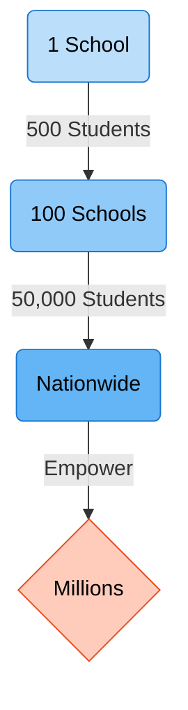

# 👨‍🏫 Saarthi AI
### *Empowering Bharat with Internet-Independent Intelligence*

  
  
  

---

## 🌍 The Mission
**Saarthi AI** is a **100% internet-independent** study partner developed by **Team HustleCult 4.1**. It transforms dense textbooks into interactive, simplified dialogues to remove the **"Internet Tax"** on learning.

* **Target:** 12.10 lakh rural schools bypassed by high-speed infrastructure.
* **Impact:** Empowering the 104,125 single-teacher schools in India with an AI co-pilot.
* **Pedagogy:** Replicates Bloom’s 2-Sigma 1-on-1 tutoring impact on budget hardware.

---
## 🛠 Technical Architecture
Designed as an **Offline-First Architecture** to deliver reasoning-grade AI to the last mile without any cloud dependency.

### ⚙️ System Workflow

---
## 💻 Technology Stack
<table width="100%">
<tr>
<td width="33%" bgcolor="#20232a" align="center"><b>FRONTEND</b></td>
<td width="33%" bgcolor="#333333" align="center"><b>BACKEND</b></td>
<td width="33%" bgcolor="#eeeeee" align="center"><b>AI ENGINE</b></td>
</tr>
<tr>
<td align="center">React.js

Electron.js

HTML/CSS/JS</td>
<td align="center">Node.js

IPC Communication</td>
<td align="center">Ollama (Llama 3)

Tesseract.js

pdf-parse</td>
</tr>
</table>

---
## ✨ 7 Core Use Cases
* **📖 Self-Study & Exploration:** Independent learning through simplified textbook content.
* **❓ Dynamic Q&A:** Highlight textbook text for instant explanations, questions, or real-life examples.
* **⚡ Instant Doubt Solving:** Get immediate answers to specific questions without waiting for a teacher.
* **📝 Automated Quiz Generation:** Auto-create MCQs from chapters for practice and performance tracking.
* **📑 Smart Summarization:** Condense long lessons into concise revision notes.
* **🖋️ Note-to-PDF Generation:** Upload notes; AI generates upgraded PDFs with better formatting and content.
* **📈 Personalized Pacing:** Adaptive learning speed and difficulty based on individual student progress.

---

## 🛡️ Risk Mitigation
| Challenge | Technical Solution |
| :--- | :--- |
| **OCR Accuracy** | **Pre-processing & Correction UI:** Image enhancement algorithms and a manual correction interface for users. |
| **AI Hallucination** | **Strict Context Retrieval:** Forced ground-truth adherence and confidence scoring to filter bad outputs. |
| **Hardware Limits** | **Optimized Quantization:** Using 4-bit quantized models (e.g., Llama 3) to run smoothly on 4GB-8GB RAM. |

---
## 🚀 Scalable Impact Model

* Accessibility: Works 100% offline for regions with poor infrastructure. 

* Cost Efficiency: Leverages free local models, eliminating recurring fees. 

* Privacy: Student data never leaves the local device. 

---
👥 Team HustleCult 4.1

* Parth Patil 

* Hemanshu Ganekar 

* Amartya Kanade 

* Poonam Gunge 

* Aditi Taralkar 

---

*Developed for a Brighter Global Future.📈*
    
